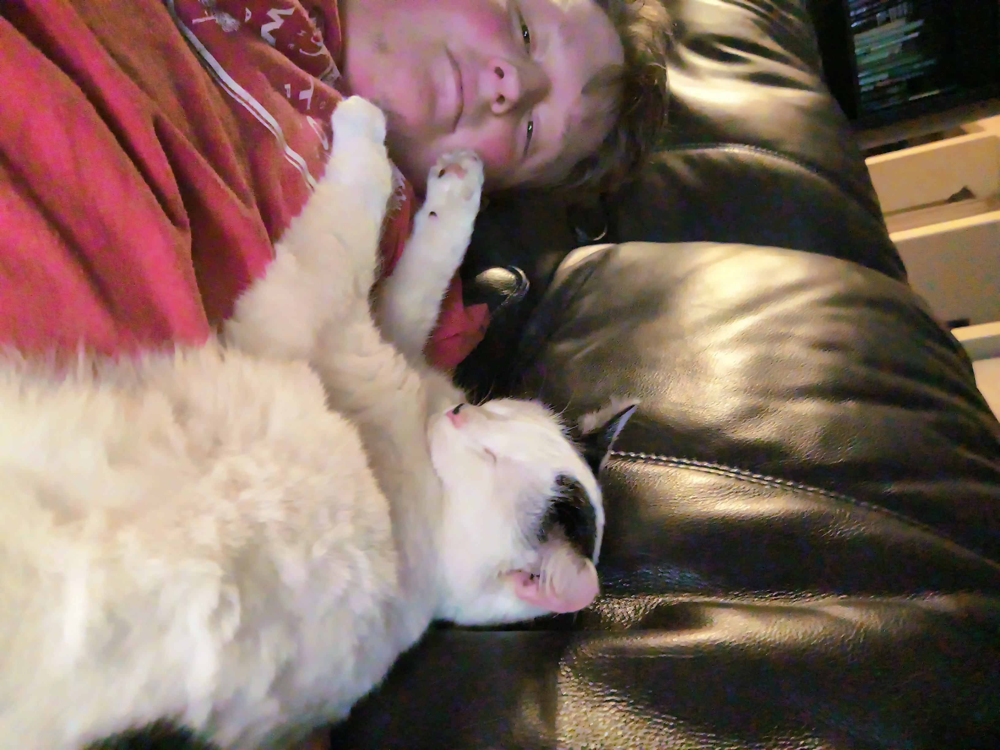

# python_console_games
Console Games Written in Python. To run the particular game you want to run, issue the following commands in your OS shell:
`python game_here.py`
Right now it is _just_ a non-working uno Game. One of the earlier commits should work. This is a repo to hold my biggest Python TUI game projects.

The planned games are:

1. UNO (Still need to implement the proper changes)
2. A guessing game
3. A text adventure game
My main website:
https://nathantibbitts.github.io

